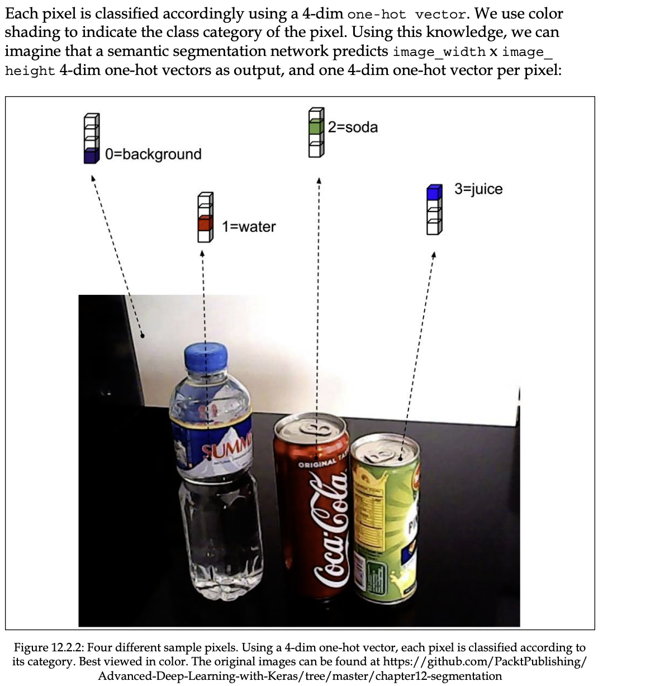

# semantic segmentation語義分割

if the goal of object detection is to perform simultaneous,localization and identification of each object in the image ,in semantic segmentation,the aim is to classify each pixel according to its object class

Extending the analogy further, in object detection, we use bounding boxes to show results. In semantic segmentation, all pixels for the same object belong to the same category. <u>Visually, all pixels of the same object will have the same color.</u> For example, all pixels belonging to the **soda can** category will be blue in color. Pixels for non-soda can objects will have a different color.

進一步擴展類比，在對象檢測中，我們使用邊界框來顯示結果。 在語義分割中，同一對象的所有像素都屬於同一類別。 在<u>視覺上，同一對象的所有像素都將具有相同的顏色</u>。 例如，屬於汽水罐類別的所有像素都將為藍色。 非汽水罐對象的像素將具有不同的顏色。

## **Segmentation**語義

Segmentation algorithms partition an image into sets of pixels or regions. The purpose of partitioning is to understand better what the image represents. The sets of pixels may represent objects in the image that are of interest for a specific application. The manner in which we partition distinguishes the different segmentation algorithms.

分割算法將圖像分割成像素集或區域集。 分區的目的是為了更好地理解圖像所代表的內容。 像素組可以表示圖像中對特定應用感興趣的對象。 我們劃分的方式區分了不同的分割算法。

### instance segmentation實例分割

In some applications, <u>we are interested in specific countable objects in a given image.</u> For example, in autonomous navigation, we are interested in instances of vehicles, traffic signs, pedestrians, and other objects on the roads. Collectively, these countable objects are called **things**. All other pixels are lumped together as background.

### semantic segmentation語義分割

In other applications, we are not interested in countable objects <u>but in amorphous uncountable regions,</u> such as the sky, forests, vegetation, roads, grass, buildings, and bodies of water. These objects are collectively called **stuff**. 

### panoptic segmentation全景分割

Roughly, **things** and **stuff** together compose the entire image. If an algorithm can identify both things and stuff pixels, 

## Semantic segmentation network語義分割網絡

semantic segmention network is a pixel-wise classifier

和簡單的分類器不同，在語義分割中we have parallel classifiers running simultaneously. Each one is generating its own one-hot vector prediction. 我們有同時運行的並行分類器。 每個都在生成自己的單熱向量預測。

The number of classifiers is equal to the number of pixels in the input image or the product of image width and height. The dimension of each one-hot vector prediction is equal to the number of stuff object categories of interest.

分類器的數量等於輸入圖像中的像素數或圖像寬度和高度的乘積。 每個單熱向量預測的維度等於感興趣的填充對像類別的數量。

**<u>network architecture</u>**

we employ a backone network as a feature extractor .we use a similar ResNetv2 network in SSD,The ResNet backone performs max pooling twice to arrive at the first set of feature maps with the dimensions being 1/4 of the input image.

The additional sets of feature maps are generated by using successivw `Conv2D(strides=2)-BN-ReLu `Layers,resulting in feature maps with dimensions (1/8,1/16,1/32)of the input image

我們使用主幹網絡作為特徵提取器。我們在 SSD 中使用類似的 ResNetv2 網絡，ResNet 主幹網絡執行兩次最大池化以到達第一組特徵映射，其維度為輸入圖像的 1/4。

額外的特徵圖集是通過使用連續的ivw Conv2D(strides=2)-BN_ReLu Layers生成的，得到輸入圖像維度為(1/8,1/16,1/32)的特徵圖

Our semantic segmentation network architecture is further enhanced by the improvements made by *Pyramid Scene Parsing Network (PSPNet) by Zhao et al. (2017)* [3]. In PSPNet, each feature map is further processed by another convolutional layer. Furthermore, the first set of feature maps is also used.

Zhao 等人對金字塔場景解析網絡 (PSPNet) 所做的改進進一步增強了我們的語義分割網絡架構。 （2017）[3]。 在 PSPNet 中，每個特徵圖都由另一個卷積層進一步處理。 此外，還使用了第一組特徵圖。

Both FCN and PSPNet upsample the features pyramid to arrive at the same size as the first set of feature maps. Afterward, all upsampled features are fused together using a Concatenate layer. The concatenated layers are then processed twice by
 a transposed convolution with strides equal to 2 to put the original image width and height back. Lastly, a transposed convolution with a kernel size of 1 and filters equal to 4 (in other words, the number of categories) and a Softmax layer are used to generate the pixel-wise categorical prediction.

FCN 和 PSPNet 都對特徵金字塔進行上採樣，以達到與第一組特徵圖相同的大小。 之後，所有上採樣的特徵都使用連接層融合在一起。 然後將連接的層處理兩次
步長等於 2 的轉置卷積，將原始圖像的寬度和高度放回原來的位置。 最後，使用內核大小為 1 和過濾器等於 4（換句話說，類別數）的轉置卷積和 Softmax 層來生成像素級分類預測。

## Semantic segmentation network in Keras

